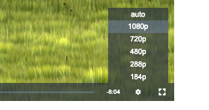

# videojs-http-source-selector

[](https://nodei.co/npm/videojs-http-source-selector/) 

VideoJS plugin that leverages videojs-contrib-quality-levels plugin to offer manual user-selectable level selection options for adaptive http streams.



# Test it with your stream [here](https://vod.dev)

Compatible with vjs 7 and up.

### Labels:
Level labels are generated from the ```height``` and ```bitrate``` metadata parsed from the stream QualityLevels sources.  If ```height``` isn't available in the stream metadata, the labels will default to ```bitrate```.

### Default settings:
You can configure a bias to lock playback to the highest or lowest resolution by default by passing one of the below plugin options into your videojs initializer.

#### Low:
```js
httpSourceSelector:
{
  default: 'low'
}
```
#### High:
```js
httpSourceSelector:
{
  default: 'high'
}
```
#### Auto:
```js
httpSourceSelector:
{
  default: 'auto'
}
```

# Installation

```sh
npm install --save videojs-contrib-quality-levels
npm install --save videojs-http-source-selector
```

# Dependencies
Requires videojs-contrib-quality-levels

# Usage

To include videojs-http-source-selector on your website or web application, use any of the following methods.

### `<script>` Tag

This is the simplest case. Get the script in whatever way you prefer and include the plugin _after_ you include [video.js][videojs], so that the `videojs` global is available. You can configure the plugin with the options described above.  

```html
<script src="//path/to/video.min.js"></script>
<script src="//path/to/videojs-http-source-selector.min.js"></script>
<script src="//path/to/videojs-contrib-quality-levels.min.js"></script>
<script>
  var options = 
  {
    plugins: {
      httpSourceSelector:
      {
        default: 'auto'
      }
    }
  };
  var player = videojs('my-video', options);
  player.httpSourceSelector();
</script>
```

### Browserify/CommonJS

When using with Browserify, install videojs-http-source-selector via npm and `require` the plugin as you would any other module.

```js
var videojs = require('video.js');
require('videojs-contrib-quality-levels');

// The actual plugin function is exported by this module, but it is also
// attached to the `Player.prototype`; so, there is no need to assign it
// to a variable.
require('videojs-http-source-selector');

var player = videojs('my-video');

player.httpSourceSelector();
```

### RequireJS/AMD

When using with RequireJS (or another AMD library), get the script in whatever way you prefer and `require` the plugin as you normally would:

```js
require(['video.js', 'videojs-contrib-quality-levels', 'videojs-http-source-selector'], function(videojs) {
  var player = videojs('my-video');

  player.httpSourceSelector();
});
```

### Building from src
To build, checkout the repo, run ```npm install``` && ```npm start```,
go to localhost:9999 (or the next free port) and test out the plugin.

### Pushing
* ```npm install```
* ```npm build```
* ```npm version major/minor/patch```
* ```git push origin master --tags```
* ```npm publish```

### WIP: get tagged commits to master to trigger github action builds that publish to npm

## License

MIT. Copyright (c) Justin Fujita;


[videojs]: http://videojs.com/
